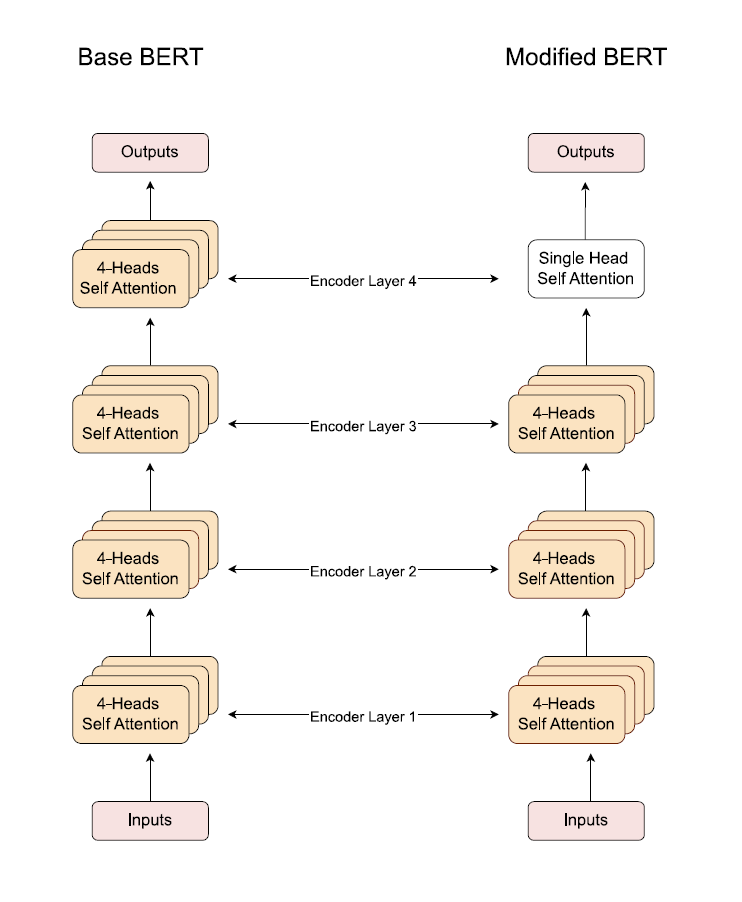
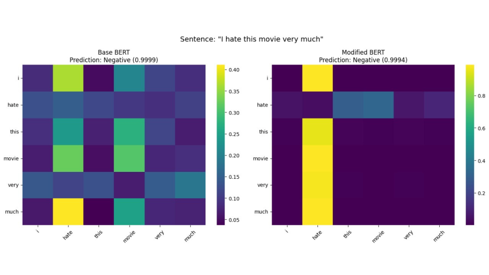
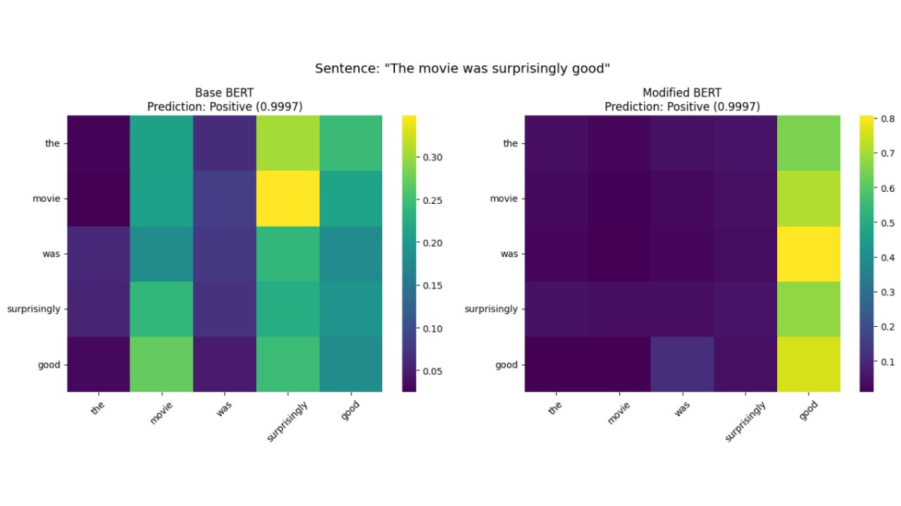
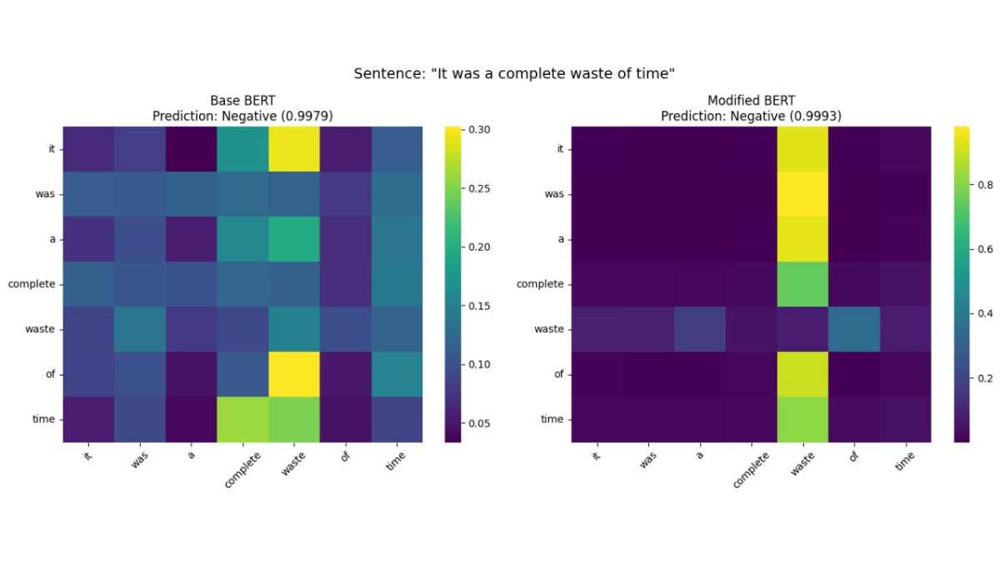

# Explainable BERT: A More Interpretable Transformer

This project introduces a custom BERT variant designed to **enhance interpretability** by replacing the final multi-head attention layer with a **Single-Head Self Attention** block.

💡 The goal: sharpen token-level focus and make model decisions more **human-understandable** — without increasing parameter count or complexity.

---

---

## 📌 Core Idea

In standard BERT, the final attention layer often spreads focus across many tokens — even irrelevant ones.

My approach:
> **Replace the final multi-head attention block** with a **single-head attention layer** to force sharper, more focused token-level decisions.

This results in:
✅ Simpler computation in final layer  
✅ Cleaner attention maps  
✅ Improved test accuracy (+1%)  
✅ Same parameter count  
✅ Much better visual and logical explainability

---

## 🧠 Attention Visualization

Here are **side-by-side attention map comparisons** between the original BERT and the modified explainable version on three different input examples:

### 🔍 Example 1

---

### 🔍 Example 2

---

### 🔍 Example 3

---

✅ In each case, you’ll notice that **Explainable BERT sharply locks onto the key token**, while Base BERT often dilutes attention across multiple less relevant words.  
This results in more interpretable outputs, better visual saliency, and cleaner decision traces for human understanding.

---

##  Repo Contents

This repo includes two tracks of development:

###  1. Working Prototype (Jupyter Notebook)
📁 [`Main_Workflow.ipynb`](./Main_Workflow.ipynb)

- Custom BERT architecture
- Simple training pipeline
- Visual comparison of token attention maps
- Binary sentiment classification (toy dataset)

---

###  2. Scalable Modular Version (In Progress)

I’m actively building a more scalable, production-ready version using Python modules.

Planned features:
- Full HuggingFace tokenizer integration  
- CLI support for training and inference  
- Visual attention map exports  
- Comparative evaluation vs vanilla BERT

---

### ⚡ Interactive Inference with Gradio (Coming Soon)

I’m also working on a lightweight **Gradio-based UI** to:
- Run inference on custom input sentences  
- Display attention maps showing key token focus  
- Compare base BERT vs explainable BERT on the fly

This will help users **visually understand how decisions are made**, right in the browser — no code required.

---

## 🙌 About Me

This project was designed and built by [**Kamalesh V**](https://www.linkedin.com/in/kamalesh007/) — an engineering student and AI builder working across the stack:  
Deep learning, NLP, CV, Transformers, XAI, and model deployment.

I'm passionate about building **original, useful, and scalable AI systems** — from **research-inspired ideas** to **real-world implementation**.

If you're working on machine learning, AI infrastructure, or experimental model design — feel free to connect and exchange ideas.

